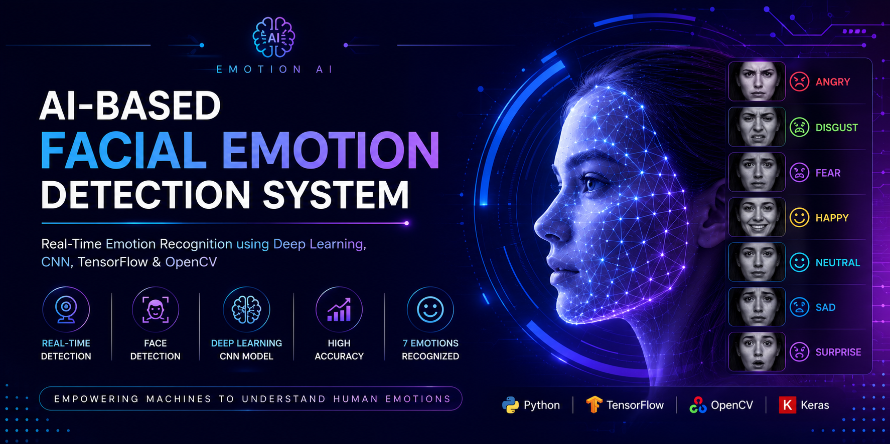
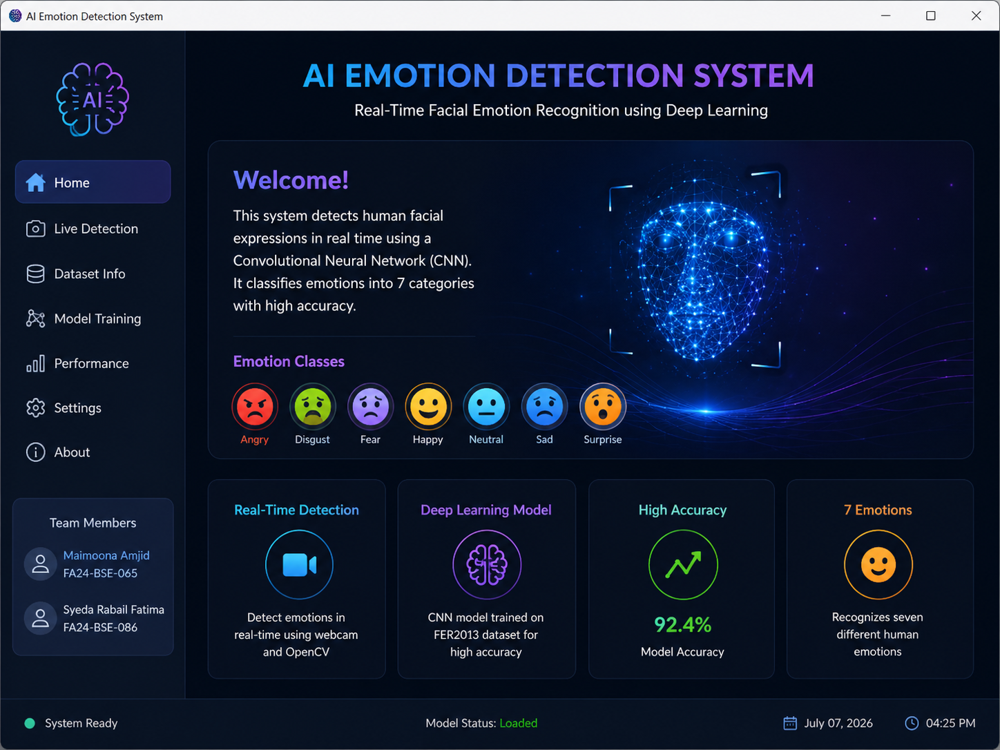
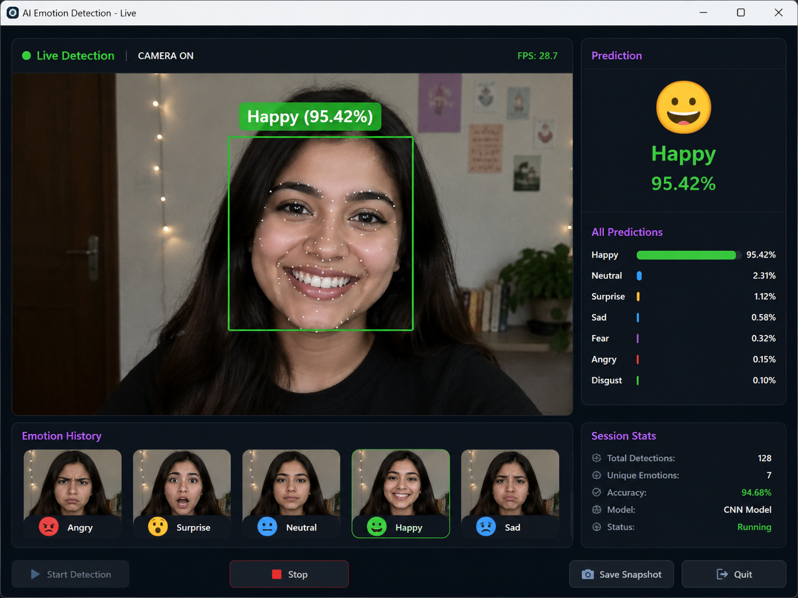

<p align="center">
  
</p>

<h1 align="center">
🎭 AI Emotion Detection System
</h1>

<p align="center">
A Deep Learning Based Real-Time Facial Emotion Recognition System using TensorFlow, OpenCV, and CNN
</p>

<p align="center">


</p>

---

# 📖 Project Overview

Artificial Intelligence has transformed the way computers understand human emotions.

This project presents a **real-time Facial Emotion Detection System** capable of recognizing human emotions through a webcam using a Convolutional Neural Network (CNN). The model processes facial expressions, classifies them into predefined emotion categories, and displays the predicted emotion instantly.

The system is designed as a semester project to demonstrate the practical implementation of **Computer Vision**, **Deep Learning**, and **Artificial Intelligence**.

---

# 🎯 Objectives

- Detect human faces in real-time
- Recognize facial emotions accurately
- Build a CNN model using TensorFlow/Keras
- Process image datasets for training
- Display emotion predictions through a webcam
- Learn practical applications of AI and Computer Vision

---

# ✨ Features

✅ Real-Time Webcam Detection

✅ Face Detection using OpenCV

✅ CNN-based Emotion Classification

✅ Image Preprocessing

✅ Model Training

✅ Model Saving & Loading

✅ Live Emotion Prediction

✅ Simple User Interface

---

# 😊 Supported Emotions

| Emotion | Status |
|---------|--------|
| 😠 Angry | ✅ |
| 🤢 Disgust | ✅ |
| 😨 Fear | ✅ |
| 😀 Happy | ✅ |
| 😐 Neutral | ✅ |
| 😢 Sad | ✅ |
| 😲 Surprise | ✅ |

---

# 🛠️ Technologies Used

| Technology | Purpose |
|------------|---------|
| Python | Programming Language |
| TensorFlow / Keras | Deep Learning |
| OpenCV | Computer Vision |
| NumPy | Numerical Computing |
| Scikit-Learn | Data Splitting |
| Haar Cascade | Face Detection |

---

# 🧠 Model Architecture

The project uses a Convolutional Neural Network (CNN) consisting of:

- Convolution Layer
- ReLU Activation
- Max Pooling
- Dropout
- Flatten Layer
- Dense Layer
- Softmax Output Layer

The trained model is saved as:

```
emotion_model.keras
```

---

# 📂 Project Structure

```
EmotionDetectionProject/
│
├── dataset/
│   └── train/
│       ├── Angry
│       ├── Disgust
│       ├── Fear
│       ├── Happy
│       ├── Neutral
│       ├── Sad
│       └── Surprise
│
├── trained_model/
│   └── emotion_model.keras
│
├── train_model.py
├── predict_emotion.py
├── preprocess_data.py
├── show_images.py
├── check_dataset.py
├── README.md
│
└── assets/
    ├── github-banner.png
    ├── project-demo.gif
    ├── screenshot1.png
    ├── screenshot2.png
```

---

# ⚙️ Installation

Clone the repository

```bash
git clone https://github.com/USERNAME/EmotionDetectionProject.git
```

Open project

```bash
cd EmotionDetectionProject
```

Create Virtual Environment

```bash
python -m venv venv
```

Activate

Windows

```bash
venv\Scripts\activate
```

Install dependencies

```bash
pip install -r requirements.txt
```

---

# ▶️ Train the Model

```bash
python train_model.py
```

---

# 🎥 Run Live Emotion Detection

```bash
python predict_emotion.py
```

Press **Q** to quit.

---

# 📸 Project Screenshots

## Home

<p align="center">

</p>

---

## Live Detection

<p align="center">

</p>

---

# 📊 Dataset

The project is trained on facial expression images containing seven emotion classes. You can download this dataset from https://www.kaggle.com/datasets/msambare/fer2013

Dataset Structure

```
Train
│
├── Angry
├── Disgust
├── Fear
├── Happy
├── Neutral
├── Sad
└── Surprise
```

---

# 🚀 Future Improvements

- Increase dataset size
- Improve prediction accuracy
- Mobile application
- Attendance System Integration
- Emotion Analytics Dashboard
- Mask Detection Support
- Eye Tracking
- Face Recognition Integration

---

# 👩‍💻 Team Members

| Name | Registration No |
|------|-----------------|
| **Maimoona Amjid** | **FA24-BSE-065** |
| **Syeda Rabail Fatima** | **FA24-BSE-086** |

---

# 👩‍🏫 Course Instructor

**Mam. Aisha**

---

# 🎓 Course

Artificial Intelligence

Semester Project

---

# 💡 Learning Outcomes

This project demonstrates practical implementation of:

- Artificial Intelligence
- Deep Learning
- Computer Vision
- Machine Learning
- Image Processing
- Neural Networks
- TensorFlow Framework
- OpenCV Library

---

# ⭐ Repository

If you found this project useful,

⭐ Please consider giving it a Star!

---

<p align="center">

Made with ❤️ using Python, TensorFlow & OpenCV

</p>
